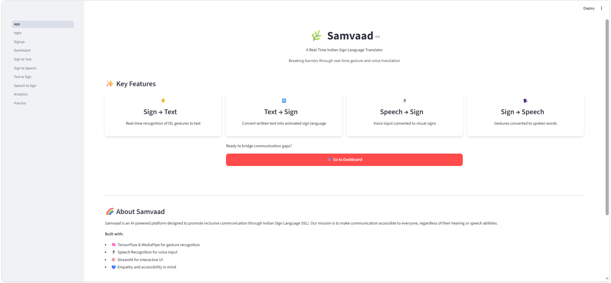
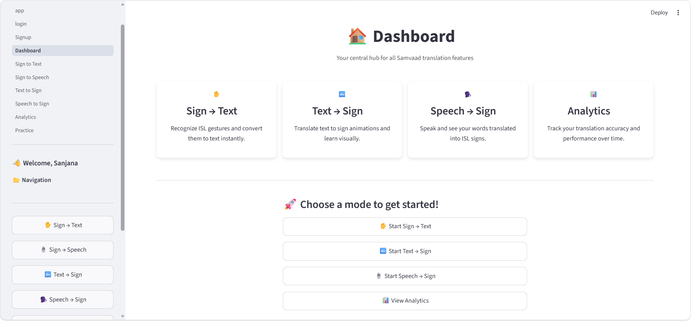
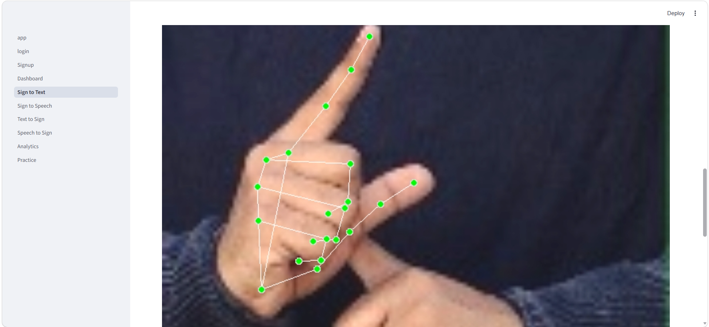
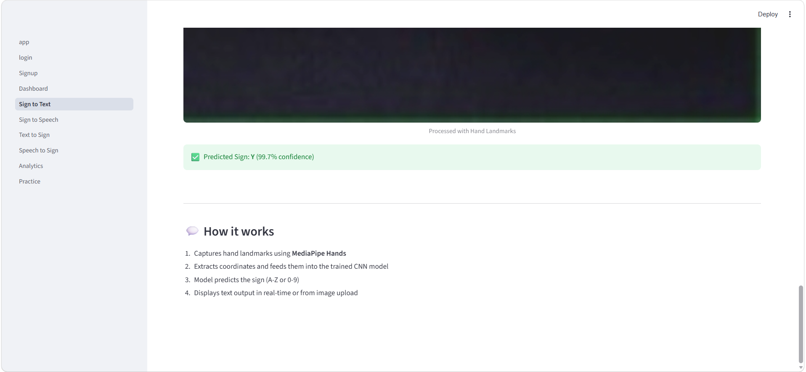
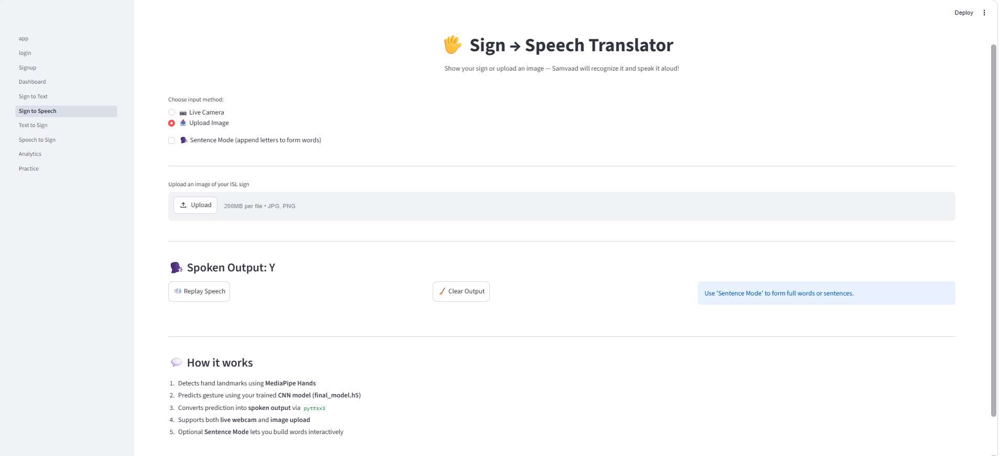
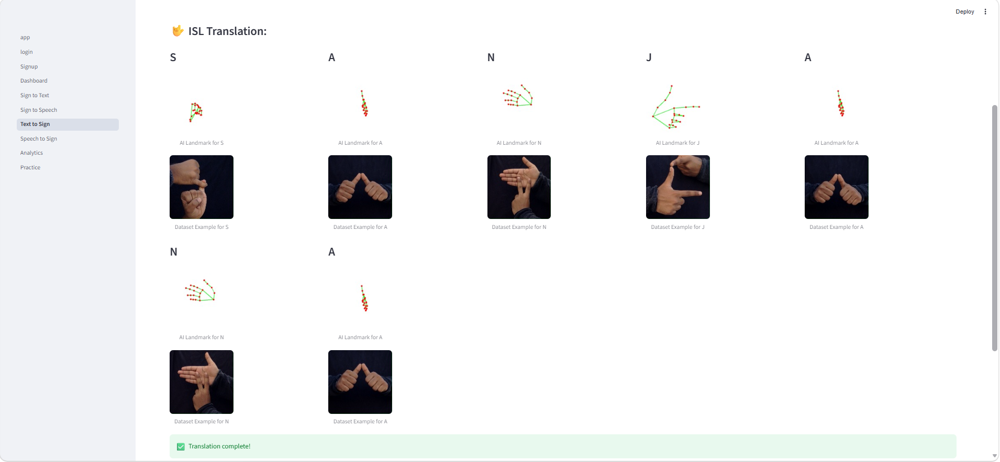
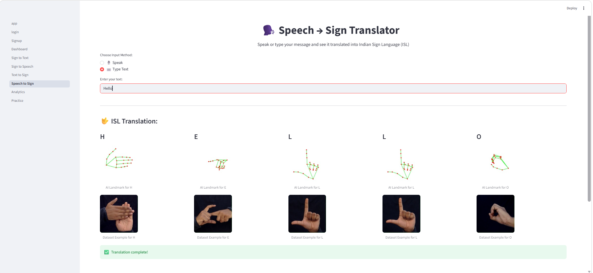
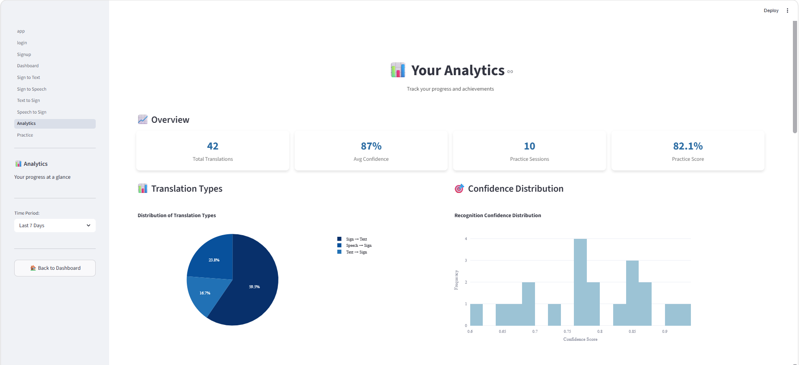
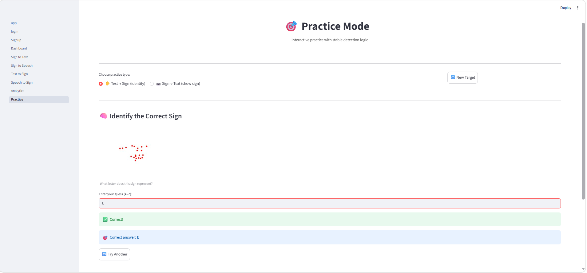

# 🌿 Samvaad – Multimodal Indian Sign Language Translator

Samvaad is an AI-powered multimodal Indian Sign Language (ISL) translation platform designed to bridge communication gaps between hearing and speech-impaired individuals and the wider community.

The system supports real-time gesture recognition, speech-to-sign conversion, sign-to-speech translation, analytics, and interactive learning modules using deep learning and computer vision.

---

# 🚀 Features

## ✋ Sign → Text
- Real-time ISL gesture recognition
- Hand landmark detection using MediaPipe
- CNN-based gesture classification
- Live prediction with confidence score

## 🗣️ Sign → Speech
- Converts recognized ISL gestures into spoken output
- Text-to-speech integration

## 🔤 Text → Sign
- Converts typed text into ISL visual representations
- Displays sign images for alphabets and numbers

## 🎙️ Speech → Sign
- Converts spoken language into ISL signs
- Speech recognition integration

## 📊 Analytics Dashboard
- Translation statistics
- Confidence distribution graphs
- Usage insights and performance tracking

## 🎯 Practice Mode
- Interactive ISL learning and testing
- Real-time feedback and score tracking

---

# 🧠 Technologies Used

- Python
- Streamlit
- TensorFlow / Keras
- MediaPipe
- OpenCV
- NumPy
- Pandas
- Matplotlib
- SpeechRecognition
- pyttsx3

---

---

# 🖥️ Screenshots

## 🏠 Home Page


---

## 📊 Dashboard


---

## ✋ Sign to Text




---

## 🔊 Sign to Speech


---

## 🔤 Text to Sign


---

## 🎙️ Speech to Sign


---

## 📈 Analytics


---

## 🎯 Practice Mode


---

# ⚙️ Installation

## 1️⃣ Clone Repository

```bash
git clone https://github.com/r-sanjana/samvaad-isl-translator.git
cd samvaad-isl-translator
```

---

## 2️⃣ Create Virtual Environment

```bash
python -m venv venv
```

### Activate Environment

#### Windows
```bash
venv\Scripts\activate
```

#### Mac/Linux
```bash
source venv/bin/activate
```

---

## 3️⃣ Install Dependencies

```bash
pip install -r requirements.txt
```

---

## 4️⃣ Run Application

```bash
streamlit run app/app.py
```
# 📂 Project Structure

```bash
Samvaad-main/
│
├── app/
│   ├── app.py                     # Main Streamlit application
│   │
│   ├── pages/                     # Multi-page Streamlit modules
│   │   ├── 1_login.py
│   │   ├── 2_Signup.py
│   │   ├── 3_Dashboard.py
│   │   ├── 4_Sign_to_Text.py
│   │   ├── 5_Sign_to_Speech.py
│   │   ├── 6_Text_to_Sign.py
│   │   ├── 7_Speech_to_Sign.py
│   │   ├── 8_Analytics.py
│   │   └── 9_Practice.py
│   │
│   ├── tools/                     # Utility tools and debugging scripts
│   │   ├── debug_hand_detect.py
│   │   └── generate_sign_images.py
│   │
│   └── utils/                     # Authentication, theming, model handling
│       ├── auth.py
│       ├── model_handler.py
│       └── theme.py
│
├── outputs/                       # Generated outputs and prediction data
│   ├── landmarks.csv
│   └── text_to_sign/
│       ├── images/
│       └── mapping.json
│
├── screenshots/                   # UI screenshots for documentation
│   ├── home-page.png
│   ├── dashboard.png
│   ├── sign-to-text1.png
│   ├── sign-to-text2.png
│   ├── sign-to-speech.png
│   ├── text-to-sign.png
│   ├── speech-to-sign.png
│   ├── analytics.png
│   └── practice-mode.png
│
├── scripts/                       # Training and preprocessing scripts
│   ├── extract_landmarks.py
│   ├── generate_templates.py
│   ├── live_recognition.py
│   ├── test_batch_predictions.py
│   ├── test_model_prediction.py
│   ├── text_to_sign.py
│   └── train_model.py
│
├── requirements.txt               # Project dependencies
├── config.toml                    # Streamlit configuration
├── README.md                      # Project documentation
└── mini projectf final report samvaad.pdf
```
---

# 🎯 Future Improvements

- Real-time sentence generation
- Advanced ISL dataset support
- Transformer-based gesture recognition
- Mobile application deployment
- Cloud deployment support
- User authentication database integration

---

# 📚 Research & Learning Goals

This project was developed as part of an AI/ML learning and research initiative focusing on:
- Computer Vision
- Human-Computer Interaction
- Accessibility Technology
- Deep Learning for Gesture Recognition
- Inclusive AI Applications

---


## Authors
**Srishti Sindgi** 
GitHub: https://github.com/sindgisrishtis

**Ujwala Shet**
GitHub: https://github.com/ujwalashet

**Sanjana R**
GitHub: https://github.com/r-sanjana
